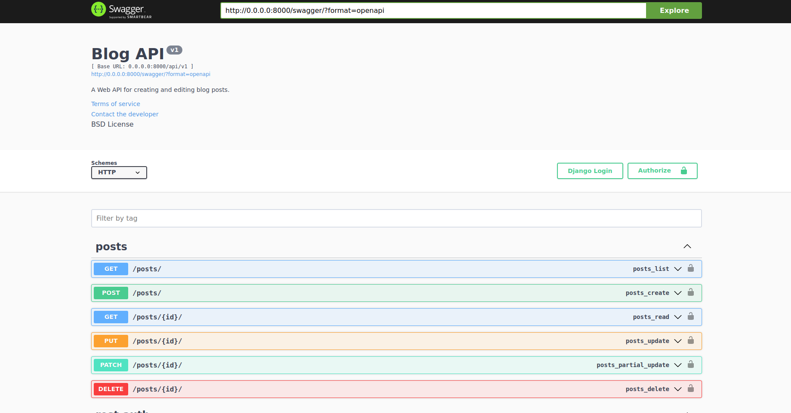

# Project description
This is simple Blog API with swagger documentation, created using Django and Django Rest Framework.



# Run project
These step suppose you have docker-compose installed.
```commandline
docker-compose build
docker-compose up
```
# Run migrations
```commandline
docker exec blogapp_web_1 python manage.py migrate --noinput
```
# Create superuser
Enter to created container (`blogapp_web_1` created container name or ID):
```commandline
docker exec -it blogapp_web_1 sh
```
and run:
```commandline
python manage.py createsuperuser
```


Open http://127.0.0.1:8000/swagger/ in your browser and login through your credentials.